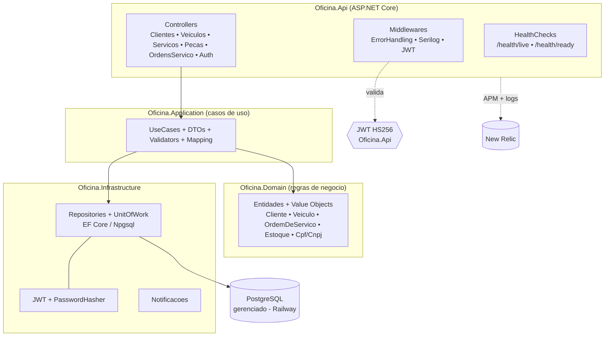

# fiap-app

Aplicação principal (**API .NET**, Clean Architecture) da oficina, executada no **Kubernetes** e observada via **New Relic**. Um dos 4 repositórios do Tech Challenge — Fase 3 (SOAT/FIAP).

Cobre o ciclo completo da **Ordem de Serviço** (recepção → orçamento → execução → entrega), gestão de clientes/veículos/serviços/peças e controle de estoque. Rotas sensíveis são protegidas por **JWT** (o token do cliente é emitido pela `fiap-auth-lambda` via CPF).

## Tecnologias
- **.NET 10 / ASP.NET Core** — Clean Architecture (Domain / Application / Infrastructure / Api)
- **EF Core + Npgsql** → **PostgreSQL gerenciado** (Railway, `fiap-infra-db`)
- **JWT Bearer** (HS256) — mesmo `issuer/audience/secret` da Lambda
- **Serilog** — logs estruturados JSON com correlação (`trace.id`/`span.id`)
- **New Relic** — APM (agent .NET) + logs + dashboards
- **Docker** + **Kubernetes** (HPA), Swagger/OpenAPI, FluentValidation, xUnit

## Arquitetura de componentes



Dependências apontam **para dentro** (Api → Application → Domain); a Infrastructure implementa as interfaces do Domain (inversão de dependência).

## Observabilidade
- **APM:** New Relic .NET agent embutido na imagem (ativado por `CORECLR_*` + `NEW_RELIC_LICENSE_KEY` em runtime).
- **Logs JSON correlacionados:** Serilog `CompactJsonFormatter`; cada evento tem `trace.id`/`span.id` (e `@tr`/`@sp` no request log) para correlação com os traces do APM.
- **Health:** `/health/live` (liveness) e `/health/ready` (readiness, checa o Postgres) — usados pelas probes do K8s.

## Execução local

### Docker Compose (app + Postgres local)
```bash
cp .env.example .env    # ajuste as variáveis
docker compose up --build
```

### Kubernetes (imagem local + fiap-infra-k8s)
```bash
docker build -t fiap-app:local .          # constrói a imagem que o cluster espera
kubectl rollout restart deployment/fiap-app -n oficina
kubectl port-forward -n oficina svc/fiap-app 8080:80
# http://localhost:8080  (Swagger na raiz)
```

### Variáveis principais
| Variável | Descrição |
|---|---|
| `ConnectionStrings__Postgres` | conexão Npgsql ao banco gerenciado (Railway) |
| `Jwt__Secret` | segredo HS256 (**igual** ao da Lambda) |
| `NEW_RELIC_LICENSE_KEY` | license key do New Relic (via Secret) |

## API / Swagger
- Swagger UI na **raiz** (`/`) e OpenAPI em `/swagger/v1/swagger.json`.
- Coleção OpenAPI versionada em [`docs/openapi.json`](docs/openapi.json).

## Testes
```bash
dotnet test Oficina.slnx -c Release      # 102 testes (domínio + aplicação + API)
```

## CI/CD (`.github/workflows/ci.yml`)
- **PR/push:** restore, build, **test + coverage**, e **docker build** da imagem.
- O deploy no cluster é responsabilidade do `fiap-infra-k8s` (Docker Desktop local). Para nuvem: push da imagem para um registry (GHCR/ECR) e rollout via credenciais.

## Documentação
- [`docs/adr/0001-observabilidade-newrelic.md`](docs/adr/0001-observabilidade-newrelic.md)
