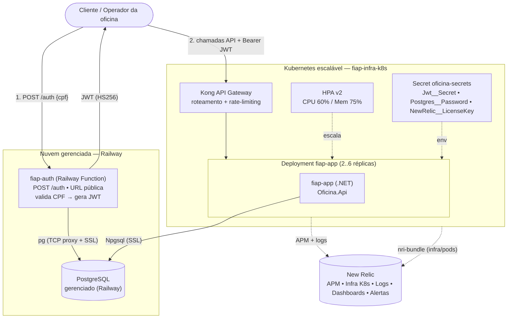
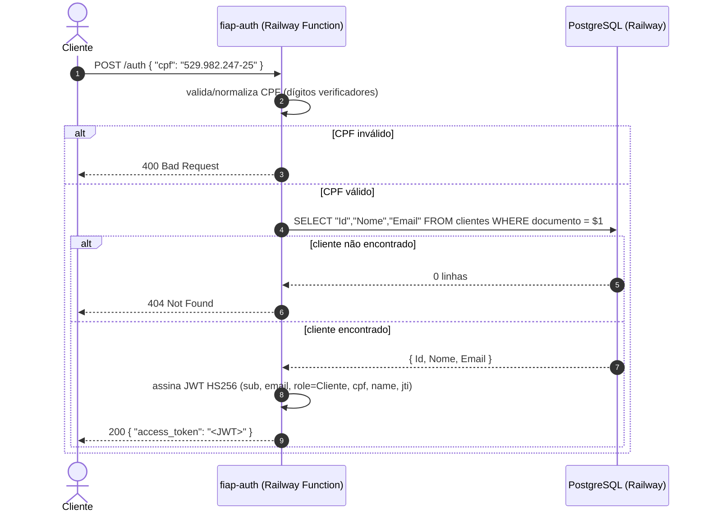
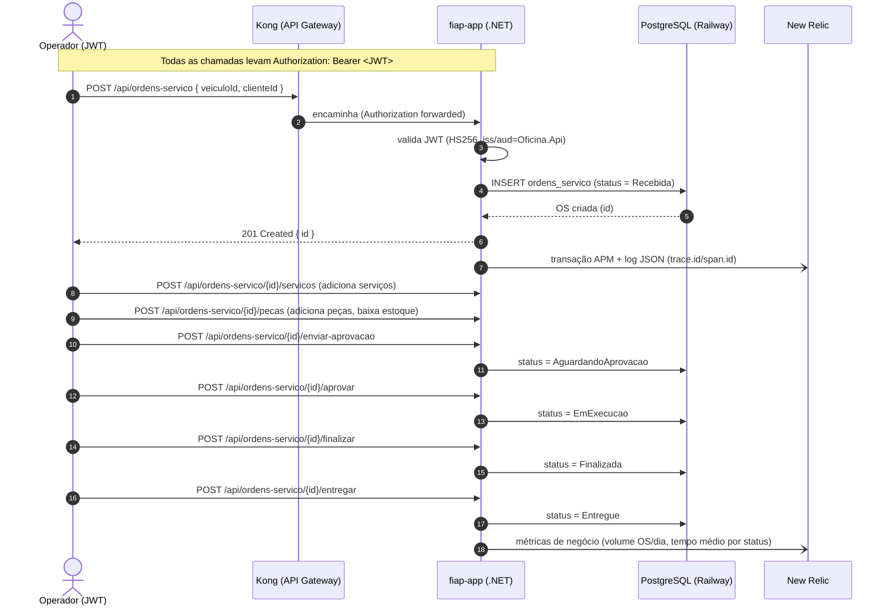

# Arquitetura do Sistema — Tech Challenge Fase 3 (SOAT/FIAP)

Visão consolidada dos **4 repositórios** que compõem a solução da oficina mecânica.
Cada repositório é entregue de forma independente (CI/CD próprio, `main` protegida, merge via PR),
mas juntos formam um único sistema.

| Repositório | Papel | Stack | Deploy |
|---|---|---|---|
| **[fiap-auth-lambda](https://github.com/MathboyL3/fiap-auth-lambda)** | Autenticação por CPF → emite JWT | TypeScript / Bun (Railway Function) | Railway Functions (serverless, URL pública) |
| **[fiap-app](https://github.com/MathboyL3/fiap-app)** | API principal da oficina (Ordens de Serviço, clientes, estoque) | .NET 10 / ASP.NET Core (Clean Architecture) | Kubernetes (Docker Desktop / HPA) atrás do Kong |
| **[fiap-infra-k8s](https://github.com/MathboyL3/fiap-infra-k8s)** | Infra do cluster + gateway Kong (namespace, deployment, HPA, Kong/Konga, secrets) | Terraform (providers `kubernetes`, `helm`) | Cluster K8s local escalável |
| **[fiap-infra-db](https://github.com/MathboyL3/fiap-infra-db)** | Banco de dados **gerenciado** | Terraform (provider `railway`) | PostgreSQL gerenciado no Railway |

Observabilidade transversal: **New Relic** (APM da API + infra Kubernetes + logs JSON correlacionados + dashboards + alertas).

---

## 1. Diagrama de componentes (visão "cloud")

O sistema combina **nuvem gerenciada (Railway)** — que hospeda o **banco** e a **autenticação** — com
um **cluster Kubernetes** que roda a **API .NET** atrás do **Kong** (API Gateway).

**Fluxo macro**
1. O cliente autentica no serviço **fiap-auth** (Railway) enviando o **CPF**; o serviço consulta o
   cliente no **Postgres gerenciado** e devolve um **JWT HS256**.
2. Com o JWT, o cliente chama a **API .NET** no **Kubernetes** através do **Kong**; a API valida o
   token (mesmo `issuer/audience/secret` da auth) e persiste no **mesmo Postgres**.
3. **New Relic** observa tudo: APM da API, infraestrutura do cluster (CPU/mem/pods) e logs JSON
   correlacionados por `trace.id`/`span.id`.

O contrato do JWT é **compartilhado** entre a auth e a API: `iss=aud=Oficina.Api`, HS256, mesmo
segredo — é o que torna a autenticação emitida pelo fiap-auth válida na API .NET.

| Componente | Onde roda | Observação |
|---|---|---|
| **Postgres** | Railway (gerenciado) | acesso via rede privada + TCP proxy público |
| **fiap-auth** (Bun) | Railway Function (serverless) | `https://function-bun-production-8bb2.up.railway.app` |
| **fiap-app** (.NET) | Kubernetes | atrás do **Kong**, HPA escalável (`fiap-infra-k8s`) |
| **Gateway** | Kubernetes | **Kong** (roteamento + rate-limiting), com **Konga** como GUI |

> O Kong encaminha o header `Authorization`; a **validação do JWT é feita pela aplicação**.
> O NGINX Ingress permanece disponível no cluster como alternativa de entrada.

---

## 2. Diagrama de sequência — Autenticação (CPF → JWT)

## 3. Diagrama de sequência — Abrir e conduzir uma Ordem de Serviço

O cliente final pode acompanhar o status **sem autenticação** por `GET /api/ordens-servico/publico/{id}/status`.

---

## 4. Escalabilidade e resiliência
- **HPA v2** no `fiap-app`: 2 a 6 réplicas, gatilhos CPU 60% / memória 75% (`select_policy=Max`).
  Escalonamento elástico automático (2→6 réplicas conforme a carga de CPU/memória).
- **Health checks**: `/health/live` (liveness) e `/health/ready` (readiness — verifica o Postgres),
  consumidos pelas probes do Kubernetes.
- **Banco gerenciado** (Railway): backup e volume persistente pelo provedor; app resiliente a
  restart de pods (estado no banco, não no pod).

## 5. Segurança
- **JWT HS256** com segredo compartilhado via Secret (K8s) / variável de ambiente (fiap-auth) — nunca versionado.
- Rotas sensíveis exigem `Bearer`; autorização por **role** (`Cliente`, `Gerente`).
- Segredos (Railway token, JWT secret, New Relic keys, senha do Postgres) ficam **fora do Git**
  (GitHub Actions Secrets / K8s Secrets / variáveis do Railway).
- **Kong** aplica **rate-limiting** na borda (proteção contra abuso) antes de encaminhar à API.

## 6. Documentos relacionados
- **RFCs** (decisões de arquitetura do sistema): [`docs/rfc/`](rfc/)
- **ADRs** por repositório:
  - fiap-app — [`docs/adr/0001-observabilidade-newrelic.md`](adr/0001-observabilidade-newrelic.md)
  - fiap-auth-lambda — `docs/adr/0001-*` (estratégia CPF→JWT), `docs/adr/0003-*` (Railway Function)
  - fiap-infra-k8s — `docs/adr/0001-hpa-escalabilidade.md`, `docs/adr/0002-gateway-ingress-e-comunicacao.md`, `docs/adr/0003-gateway-kong.md`
  - fiap-infra-db — `docs/adr/0001-*`, `docs/adr/0002-*` + `docs/MODELO-DADOS.md` (ER + justificativa do banco)
- **Observabilidade**: [`observability/README.md`](../observability/README.md) (dashboard as-code + alertas)
