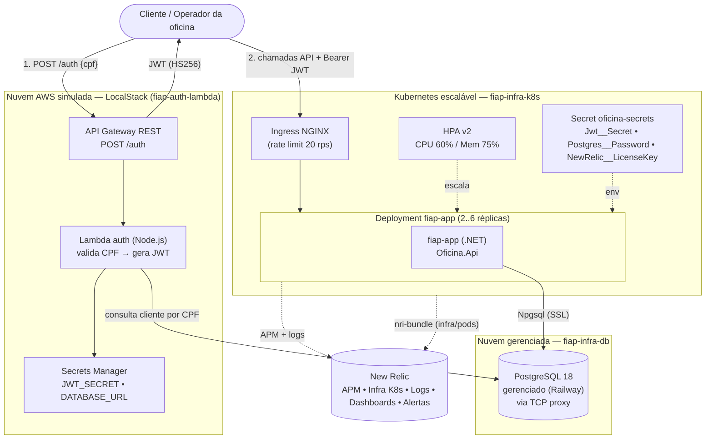
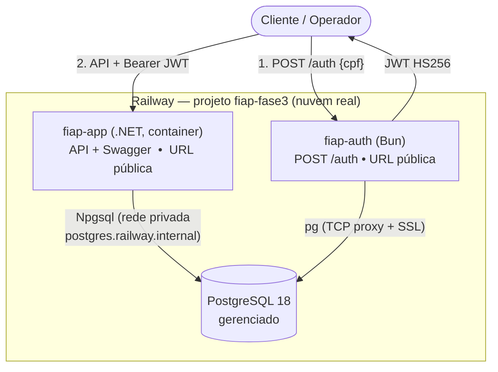
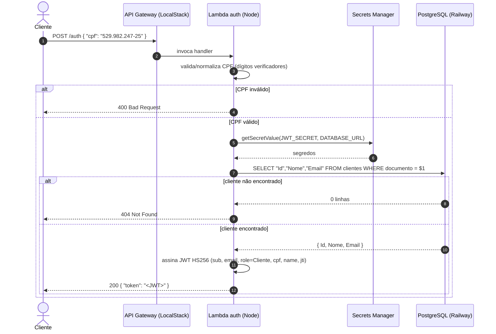
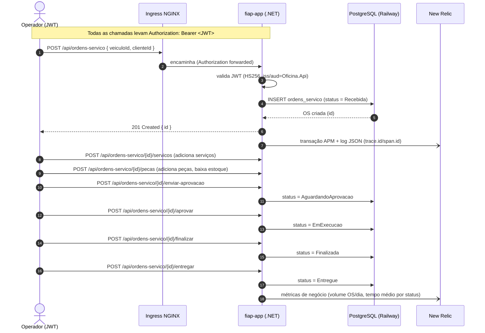

# Arquitetura do Sistema — Tech Challenge Fase 3 (SOAT/FIAP)

Visão consolidada dos **4 repositórios** que compõem a solução da oficina mecânica.
Cada repositório é entregue de forma independente (CI/CD próprio, `main` protegida, merge via PR),
mas juntos formam um único sistema.

| Repositório | Papel | Stack | Deploy |
|---|---|---|---|
| **[fiap-auth-lambda](https://github.com/MathboyL3/fiap-auth-lambda)** | Autenticação por CPF → emite JWT | Node.js/TypeScript, API Gateway + Lambda | LocalStack (nuvem AWS simulada, portável p/ AWS real) |
| **[fiap-app](https://github.com/MathboyL3/fiap-app)** | API principal da oficina (Ordens de Serviço, clientes, estoque) | .NET 10 / ASP.NET Core (Clean Architecture) | Kubernetes (Docker Desktop / HPA) |
| **[fiap-infra-k8s](https://github.com/MathboyL3/fiap-infra-k8s)** | Infra do cluster (namespace, deployment, HPA, Ingress, secrets) | Terraform (provider `kubernetes`) | Cluster K8s local escalável |
| **[fiap-infra-db](https://github.com/MathboyL3/fiap-infra-db)** | Banco de dados **gerenciado** | Terraform (provider `railway`) | PostgreSQL 18 gerenciado no Railway |

Observabilidade transversal: **New Relic** (APM da API + infra Kubernetes + logs JSON correlacionados + dashboards + alertas).

---

## 1. Diagrama de componentes (visão "cloud")

**Fluxo macro**
1. O cliente autentica no **API Gateway** (LocalStack) enviando o **CPF**; a **Lambda** consulta o
   cliente no **Postgres gerenciado** e devolve um **JWT HS256**.
2. Com o JWT, o cliente chama a **API .NET** no **Kubernetes** (via **Ingress**); a API valida o
   token (mesmo `issuer/audience/secret` da Lambda) e persiste no **mesmo Postgres**.
3. **New Relic** observa tudo: APM da API, infraestrutura do cluster (CPU/mem/pods) e logs JSON
   correlacionados por `trace.id`/`span.id`.

O contrato do JWT é **compartilhado** entre Lambda e API: `iss=aud=Oficina.Api`, HS256, mesmo
segredo — é o que torna a autenticação emitida na Lambda válida na API .NET.

---

## 1b. Deploy em nuvem real (Railway)

Além da nuvem AWS **simulada** (LocalStack) e do Kubernetes **local**, o sistema também roda
**em nuvem real** no **Railway** — no mesmo projeto `fiap-fase3` do banco. É o deploy de
"produção", com URLs públicas e deploy automático a partir dos repositórios no GitHub.

| Serviço | Tipo no Railway | URL pública |
|---|---|---|
| **fiap-app** (.NET) | container (Dockerfile, autodeploy do repo) | `https://fiap-app-production.up.railway.app` |
| **fiap-auth** (Node/Bun) | container `Bun.serve` (autodeploy do repo) | `https://fiap-auth-production.up.railway.app` |
| **Postgres** | banco gerenciado | rede privada `postgres.railway.internal` + TCP proxy |

**Notas de implantação**
- A **app .NET** conecta ao Postgres pela **rede privada** interna do Railway; a **auth (Bun)** usa
  o **TCP proxy público com SSL** (o driver `pg` do Node não resolve a rede privada IPv6-only).
- Cada serviço fixa `PORT` alinhado ao *target port* do domínio público do Railway.
- O contrato do **JWT é o mesmo** em qualquer topologia (HS256, `iss/aud=Oficina.Api`, mesmo
  segredo), então a auth de um ambiente é aceita pela API do mesmo ambiente.

> **Três topologias, mesmo código e mesmo contrato:** nuvem AWS simulada (LocalStack) · Kubernetes
> local escalável (HPA) · **nuvem real (Railway)**. A escolha é só de infraestrutura.

## 2. Diagrama de sequência — Autenticação (CPF → JWT)

## 3. Diagrama de sequência — Abrir e conduzir uma Ordem de Serviço

O cliente final pode acompanhar o status **sem autenticação** por `GET /api/ordens-servico/publico/{id}/status`.

---

## 4. Escalabilidade e resiliência
- **HPA v2** no `fiap-app`: 2 a 6 réplicas, gatilhos CPU 60% / memória 75% (`select_policy=Max`).
  Escalonamento elástico automático (2→6 réplicas conforme a carga de CPU/memória).
- **Health checks**: `/health/live` (liveness) e `/health/ready` (readiness — verifica o Postgres),
  consumidos pelas probes do Kubernetes.
- **Banco gerenciado** (Railway): backup e volume persistente pelo provedor; app resiliente a
  restart de pods (estado no banco, não no pod).

## 5. Segurança
- **JWT HS256** com segredo compartilhado via Secret (K8s) / Secrets Manager (Lambda) — nunca versionado.
- Rotas sensíveis exigem `Bearer`; autorização por **role** (`Cliente`, `Gerente`).
- Segredos (Railway token, JWT secret, New Relic keys, senha do Postgres) ficam **fora do Git**
  (GitHub Actions Secrets / K8s Secrets / Secrets Manager).

## 6. Documentos relacionados
- **RFCs** (decisões de arquitetura do sistema): [`docs/rfc/`](rfc/)
- **ADRs** por repositório:
  - fiap-app — [`docs/adr/0001-observabilidade-newrelic.md`](adr/0001-observabilidade-newrelic.md)
  - fiap-auth-lambda — `docs/adr/0001-*`, `docs/adr/0002-*`
  - fiap-infra-k8s — `docs/adr/0001-hpa-escalabilidade.md`, `docs/adr/0002-gateway-ingress-e-comunicacao.md`
  - fiap-infra-db — `docs/adr/0001-*`, `docs/adr/0002-*` + `docs/MODELO-DADOS.md` (ER + justificativa do banco)
- **Observabilidade**: [`observability/README.md`](../observability/README.md) (dashboard as-code + alertas)
